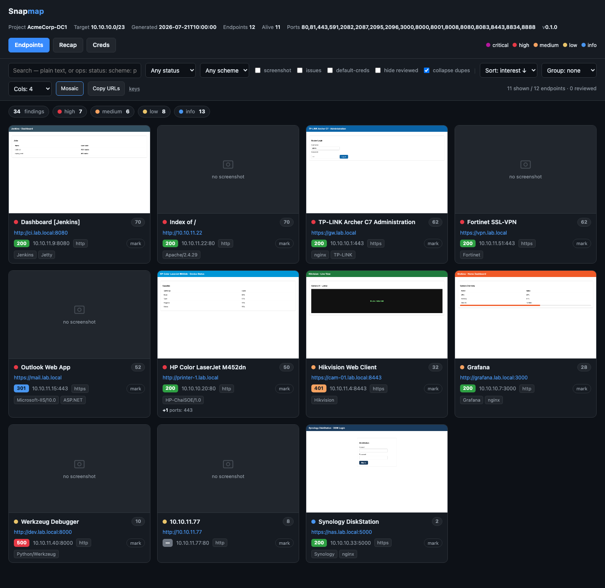
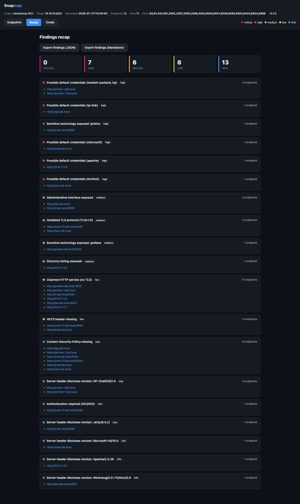
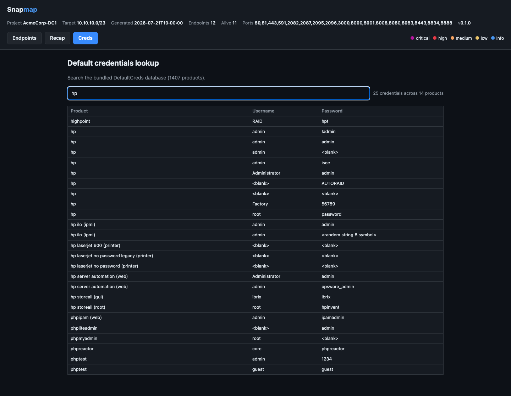
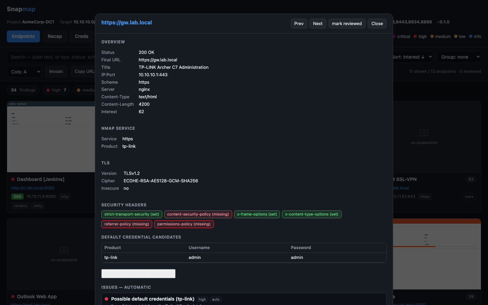

# Snapmap

Fast, nmap-driven web attack-surface recon condensed into a single, self-contained HTML report.

Snapmap sweeps a subnet with nmap, finds every exposed web interface, probes and
fingerprints each one, captures a screenshot with Playwright, and writes **one HTML
file** (screenshots embedded, no external assets, no pagination) with instant
client-side search, filtering, grouping, a per-endpoint issue editor and a findings
recap. It is a spiritual rewrite of [aquatone](https://github.com/michenriksen/aquatone),
reworked around nmap and a single shareable page.

## Screenshots

Everything below is one self-contained HTML file (data is synthetic).

| Endpoints (mosaic view) | Findings recap |
| --- | --- |
|  |  |

| Default-credentials lookup | Endpoint detail |
| --- | --- |
|  |  |

## Why a rewrite

| | aquatone | Snapmap |
| --- | --- | --- |
| Port scanning | built-in TCP scanner | delegated to **nmap** (speed, accuracy, `-sV`) |
| Screenshots | chromedp (flaky headless) | **Playwright** (reliable, auto-managed Chromium) |
| Report | HTML + `screenshots/`, `headers/`, 12 JS files | **one self-contained HTML file** (base64 assets, vanilla JS) |
| Layout | paginated carousel, Vue SPA | single scrollable page, instant filters, no framework |
| Findings | — | automatic **issues** + manual annotations + **recap** |
| Credentials | — | proposes **default credentials** from a bundled database |

## Features

- Fast nmap sweep of a target/CIDR/range (host discovery + web-port scan with `--min-rate`), or ingestion of an existing nmap/masscan XML.
- Concurrent HTTP probing (status, title, server, redirects, headers, content type).
- Technology fingerprinting (servers, frameworks, common devices and admin panels).
- TLS inspection (negotiated version and cipher, flagging deprecated protocols).
- Favicon hashing (mmh3) for cross-host correlation.
- Automatic issues (default credentials, cleartext HTTP, outdated TLS, directory
  listing, exposed admin/login, version disclosure, sensitive technologies, ...),
  each weighted into a per-endpoint interest score.
- **Default-credential proposals**: fingerprint signals are matched against a bundled
  database to suggest candidate credentials for the identified product (passive only).
- Single self-contained HTML report: card grid, lazy-loaded screenshots, search,
  filters (status class, scheme, has-screenshot, has-issues, has-default-creds,
  severity), sorting, grouping by host or subnet, a detail modal, a manual issue
  editor (persisted in `localStorage`), and a findings recap with JSON/Markdown export.
- Project folders: group every artifact of an engagement (report, JSON, CSV, and the
  raw nmap `.xml`/`.nmap`/`.gnmap`) into a named directory.
- JSON and CSV exports for downstream tooling.

## How it works

```
target/CIDR ──▶ nmap (discovery + web ports, -sV)
                   │ XML
                   ▼
             parse hosts/services ──▶ derive web endpoints (scheme by port/service)
                   │
                   ▼
             probe (httpx, async) ──▶ fingerprint · TLS · favicon
                   │
                   ▼
             match default creds ──▶ generate issues ──▶ interest score
                   │
                   ▼
             Playwright screenshots
                   │
                   ▼
             single HTML report  (+ JSON, CSV)
```

## Requirements

- Python 3.10+ (uv can install/manage it for you)
- [nmap](https://nmap.org/) on `PATH` — only for the `scan` subcommand; the `report`
  and `scan --direct` modes do not need it (`brew install nmap`, `apt install nmap`, ...)
- A Chromium build for Playwright (one command below). Screenshots are optional;
  without a browser Snapmap still produces the full report.

## Installation

Snapmap is [uv](https://docs.astral.sh/uv/)-native. From a fresh clone you are ready in
two commands — uv reads `uv.lock` and builds a reproducible environment automatically:

```bash
git clone https://github.com/Giorgiofox/snapmap
cd snapmap

uv sync                              # create the venv + install everything (pinned)
uv run playwright install chromium   # one-time: fetch the headless browser

# run it (uv run resolves the environment for you)
uv run snapmap --help
uv run snapmap scan 10.0.0.0/24 --project ClientX
```

That is all you need after cloning the repo. Prefix any command with `uv run`, or
activate the venv once (`source .venv/bin/activate`) and call `snapmap` directly.

<details>
<summary>Without uv (plain pip + venv)</summary>

```bash
python3 -m venv .venv && source .venv/bin/activate
pip install -e .
playwright install chromium
snapmap --help
```

</details>

## Usage

```bash
# Fast sweep of a subnet into a project folder (nmap + screenshots + report + json/csv)
snapmap scan 10.0.0.0/24 --project AcmeCorp

# A quick, focused sweep: a small port set, fast mode (skip nmap version detection)
snapmap scan 10.0.0.0/24 --ports 80,443,8080,8443 --fast --project AcmeCorp

# Whole /22 across the web port list, skipping host discovery
snapmap scan 10.10.0.0/22 -Pn --ports web --project ClientX

# Behind a SYN-proxy / captive appliance (e.g. Zscaler, Meraki) where every port
# looks open: skip nmap and probe the IP x port grid directly over HTTP
snapmap scan 10.10.0.0/24 --direct --ports web --project ClientX

# Ingest an existing nmap/masscan XML (from a file or stdin)
snapmap report --nmap scan.xml -o report.html
cat scan.xml | snapmap report --project OldScan

# Look up default credentials for a product, from the terminal
snapmap creds laserjet
snapmap creds grafana

# Refresh the bundled default-credentials database
snapmap update-creds
```

Run `snapmap --help`, `snapmap scan --help`, or `snapmap report --help` for the full,
colorized option reference.

### Project folders

`--project NAME` (`-p`) routes every output into a folder named `NAME/`:

```
AcmeCorp/
  snapmap_report.html     single self-contained report
  snapmap_results.json    machine-readable results (no screenshots)
  snapmap_results.csv     spreadsheet-friendly summary
  screenshots/            one PNG per responsive endpoint
  nmap_scan.xml           raw nmap output (XML)
  nmap_scan.nmap          raw nmap output (human-readable)
  nmap_scan.gnmap         raw nmap output (greppable)
```

This keeps engagements spanning several subnets or configurations tidy and easy to review.

### Port aliases

`--ports` accepts a custom list/range (`80,443,8000-8100`) or one of the built-in aliases:

- `small`: 80, 443
- `medium`: 80, 443, 8000, 8080, 8443
- `web` (default): common web ports (80, 81, 443, 3000, 8000-8888, ...)
- `large`: same as `web`
- `xlarge`: an extensive web-port list

## The HTML report

The report is a single file you can email, archive or open offline. Everything is
client-side:

- **Toolbar** — full-text search with operators (`status:` `scheme:` `port:` `ip:`
  `tech:` `has:creds|issues|shot|reviewed`), filters, sorting, and grouping by host,
  subnet or none. A severity summary bar doubles as a one-click filter.
- **Layout** — a **Cols** selector (6/4/2/1) and a one-click **Mosaic** button for a
  flat N-per-row grid regardless of IP. Identical pages on different ports of the same
  host are **collapsed** into one card (with a `+N ports` badge) so 80/443 duplicates
  do not clutter the view.
- **Card** — screenshot thumbnail (lazy-loaded), title, URL, status badge, IP:port,
  technology chips, worst-severity indicator, interest score, and a "reviewed" toggle
  (persisted in `localStorage`) for triage.
- **Detail modal** — overview, nmap service/product/version, TLS, security headers,
  favicon hash, response headers, the default-credential candidates, and an issue
  editor. Keyboard-friendly (`/` search, arrows to page between endpoints, `Esc`).
- **Recap** — findings aggregated by severity and grouped by issue with the affected
  endpoints, plus one-click export of the findings as JSON or Markdown.
- **Creds** — a searchable copy of the default-credentials database embedded in the
  report, so you can look up a product's default logins without leaving the page.

## Default credentials

Snapmap ships a credentials database (`snapmap/data/default_creds.csv`, ~3,700 entries)
derived from [DefaultCreds-cheat-sheet](https://github.com/ihebski/DefaultCreds-cheat-sheet)
(which itself aggregates changeme, routersploit and SecLists). When a product is
fingerprinted (from the nmap product, Server header, page title or detected
technologies), matching default credentials are **proposed** in the report.

You can also search the database by hand — from the terminal with `snapmap creds <query>`,
or inside the report via the **Creds** tab (and the "Search creds DB for this device"
link in each endpoint's detail modal).

This is passive: Snapmap never attempts authentication. Update the database at any time
with `snapmap update-creds`.

## Authorized use only

Snapmap is intended for security assessments of systems you own or are explicitly
authorized to test (penetration tests, audits, research, CTFs). Scanning and probing
networks without permission may be illegal. You are responsible for how you use it.

## Development

Module contracts and architecture are documented in [SPEC.md](SPEC.md). The package is
split into focused modules: `nmap_scan`, `prober`, `screenshot`, `fingerprint`,
`creds`, `issues`, `report`, `pipeline` and `cli`.

## Credits

- [aquatone](https://github.com/michenriksen/aquatone) by Michael Henriksen — the
  original idea and inspiration.
- [DefaultCreds-cheat-sheet](https://github.com/ihebski/DefaultCreds-cheat-sheet) for
  the default-credentials dataset.

## License

MIT. See [LICENSE](LICENSE).
